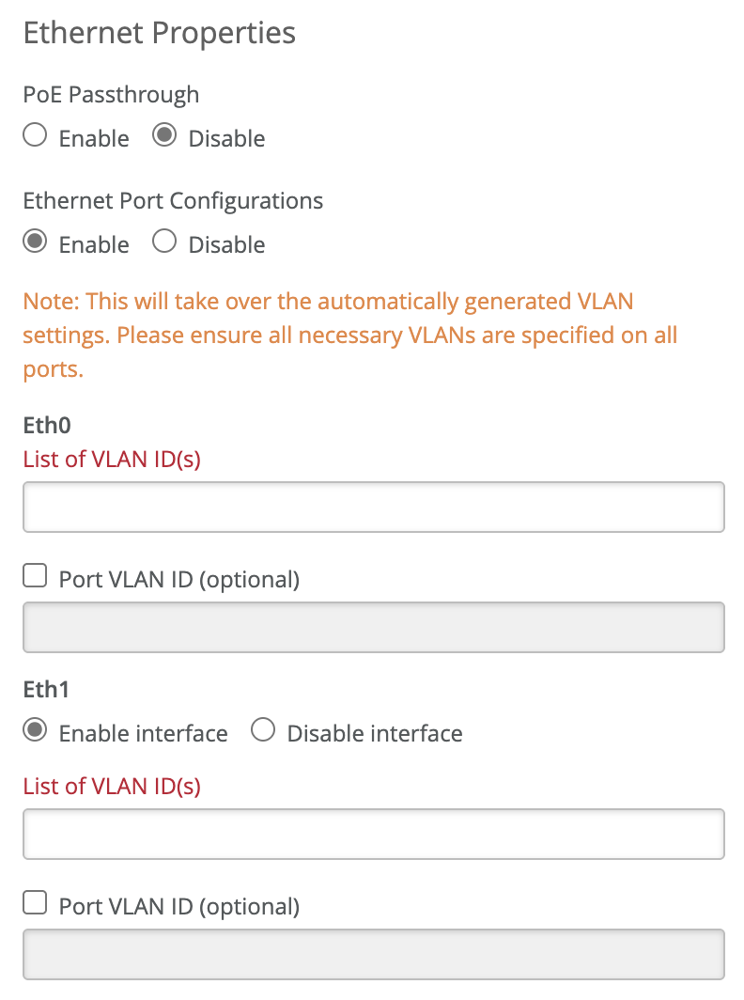
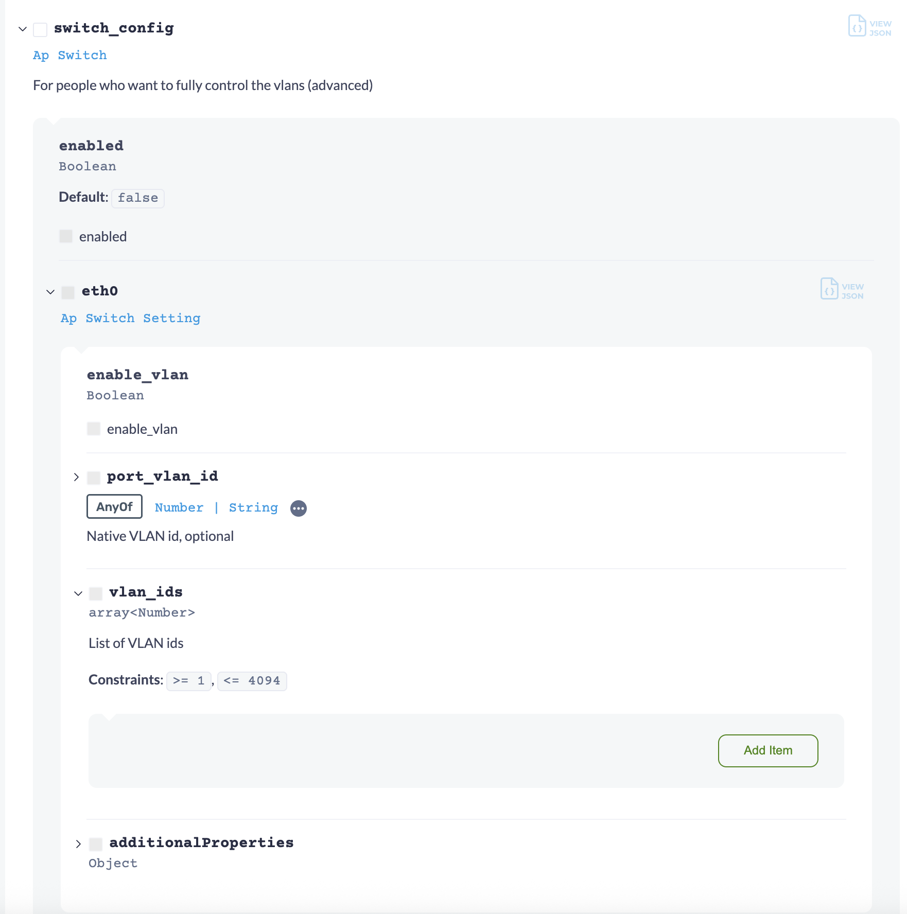

In this post, I'm going to get straight to the point and answer three questions I had about the [Juniper teleworker solution](https://www.juniper.net/documentation/us/en/software/mist/mist-edge-guide/mist-edge/topics/topic-map/switch-proxy-server-config.html) that I eventually solved through trial and error. This is focused on the configuring the additional wired ports available -- at the time of writing this -- on AP12, AP41, AP43, AP45, and AP47s.

The three questions: 

- How are the tunnels established between the additional wired ports on APs that have eth1+ (i.e., eth1-4)?
- What are the differences between creating a device profile in the Mist UI and creating them via the API?
- How can an API call be made to create or modify a device profile that also configures RADIUS/802.1x on AP wired ethernet ports?



# How are the tunnels established between the additional wired ports on APs that have eth1+ (i.e., eth1-4)?

The [official documentation on wired port configuration](https://www.juniper.net/documentation/us/en/software/mist/mist-edge-guide/mist-edge/topics/topic-map/teleworker-configure.html#id_tkq_cnk_wyb) is entirely clear on this question. At best, it says:

> "Use the additional wired ports to extend a tunneled VLAN to a wired port."

The problem with this is this: I'm an idiot, so I need something a bit more clear, succinct, and to the point. 

Here's what I learned about device profiles and/or the configuration of these AP ethernet ports in my own words:

- On ports eth0, this is your main uplink and it a trunk (see item **'A'** on the diagram). The default VLAN is '1' on these ports, and pretty much this should left alone on teleworker APs, so keep this port configured with VLAN 1.
- If you configure other VLANs on the eth0 trunk (item **'A'**), ensure the VLANs on the trunk do not match the VLAN IDs on the other wired ethernet ports (eth1-4, item **'B'**) because the AP will then trunk those VLANs to port eth0.
- (**Important**) If the VLAN IDs on ports eth1-4 (item **'B'**) match the VLANs on a Mist tunnel configured on a Mist Edge (item **'E'**, the Mist AP will establish a tunnel (item **'C'**) for those ports. 
- (**Important**) The tunnel used will be the same tunnel configured for for wireless SSID tunneling (aka, 'wxtunnel' in the API, item **'D'**). If you do not configure a tunnel for a wireless SSID, ('Custom Forwarding' in the WLAN configuration), I can only infer, but have not validated, that you will need to use API calls because there are no configuration options in the Mist UI for tunnels to select (I say this because dot1x configuration is not in the UI, and is also only configurable in the API, but more on that later).

See the following tunnel configuration from a Mist Edge configuration.


If VLANs 800 and 900 on are the tunnel (in my hypothetical) on the Mist Edge configuration, and if the VLANs are configured on the ports (see below), then tunnels will establish.


In summary, items **'B'** on the main teleworker diagram need to exist on items **'E'** on the Mist Edge tunnel configuration for the wired ports to tunnel back to the Mist Edge.
# What are the differences between creating a device profile in the Mist UI and creating them via the API?

## Mist UI

For the APs, the Mist UI has device profile options that probably meet 90%+ of the use cases that are needed. 



On the API side of things, the Mist UI configures the following:

```json
{
    "poe_passthrough": false,
    "disable_eth1": false,
    "disable_eth2": false,
    "disable_eth3": true,
    "disable_module": true,
    "radio_config": {},
    "mesh": {
        "enabled": false,
        "role": "base",
        "group": null
    },
    "ip_config": {
        "type": "dhcp",
        "mtu": 0
    },
    "ble_config": {
        "power_mode": "default",
        "beacon_enabled": true
    },
    "switch_config": {
        "enabled": true,
        "eth0": {
            "vlan_ids": [
                1
            ],
            "port_vlan_id": ""
        },
        "eth1": {
            "vlan_ids": [
                800
            ],
            "port_vlan_id": ""
        },
        "eth2": {
            "vlan_ids": [
                900
            ],
            "port_vlan_id": ""
        },
        "eth3": {
            "vlan_ids": [],
            "port_vlan_id": ""
        },
        "module": {
            "vlan_ids": [],
            "port_vlan_id": ""
        },
        "wds": {
            "vlan_ids": [],
            "port_vlan_id": ""
        }
    },
    "esl_config": {
        "enabled": false,
        "type": "imagotag",
        "host": "",
        "channel": null,
        "vlan_id": 1
    },
    "aeroscout": {
        "enabled": false,
        "locate_connected": false,
        "host": "",
        "port": 1144
    },
    "uplink_port_config": {
        "dot1x": false
    },
    "centrak": {
        "enabled": false
    },
    "vars": {},
    "id": "00000000-0000-0000-0000-000000000000",
    "name": "dummy-profile",
    "org_id": "00000000-0000-0000-0000-000000000000",
    "created_time": 1748479960,
    "modified_time": 1748479960,
    "type": "ap"
}
```

> [!note]
> I'm using the Mist API Extension to quickly gather this information:
> [GitHub - Mist-Automation-Programmability/mist\_browser\_extension: Web Browser extension for Mist Developpers to provide quick access to Mist APIs. The application is analysing the URL of the current tab to provides the org\_id, site\_id (if any) object\_id (if any) and quick access the main API calls for this page. It can also be used to manage and generate User and Org API Token.](https://github.com/Mist-Automation-Programmability/mist_browser_extension)

The Mist UI configures default device profiles options using the ['switch_config' property in the API](https://www.juniper.net/documentation/us/en/software/mist/api/http/api/orgs/device-profiles/create-org-device-profile). 

If you look at the configuration though, there are actually very few options:



If you use the API though, there are far more options.

## Mist API

The Mist API has property option not available in the UI: *port_config*.

[Ap Port Config - Mist API Reference](https://www.juniper.net/documentation/us/en/software/mist/api/http/models/structures/ap-port-config)

This property contains options for dot1x, mac auth, Mist NAC, and more that provides way more versatility than the *switch_config* property. In fact, in the [older Mist API documentation](https://api.ac2.mist.com/api/v1/docs/Site#device-config), it makes the following note:

```
        // eth0 is not allowed here
        // if spcified, this takes predecence over switch_config (deprecated)
```

Which come to find out, `port_config` takes precedence over `switch_config`. However, `port_config` options are not available in the Mist UI, only in the API. 
# How can an API call be made to create or modify a device profile that also configures RADIUS/802.1x on AP wired ethernet ports?

I'm doing this the easy way: Postman.

[Mist Cloud APIs 2505.1.1 Documentation](https://www.postman.com/juniper-mist/mist-systems-s-public-workspace/documentation/sbkq1fm/mist-cloud-apis-2505-1-1)

I've made the following API call:

[createOrgDeviceProfiles](https://www.postman.com/juniper-mist/mist-systems-s-public-workspace/request/ohvx2f1/createorgdeviceprofiles?action=share&source=copy-link&creator=38029947&ctx=documentation) or [updateOrgDeviceProfiles](https://www.postman.com/juniper-mist/mist-systems-s-public-workspace/request/k5qb5al/updateorgdeviceprofiles?action=share&source=copy-link&creator=38029947)

Using `port_config`, we have options to configure MAC-based authentication, dot1x-based authentication, and other options. For the problem I was trying to solve, I created used the following body statement to configure dot1x ports with Mist Access Assurance.

```json
{
  "led": {
    "brightness": 255,
    "enabled": true
  },
  "name": "Teleworker-AP",
  "type": "ap",
  "port_config": {
    "eth1": {
      "disabled": false,
      "enable_mac_auth": true,
      "mac_auth_protocol": "eap-md5",
      "forwarding": "mxtunnel",
      "mxtunnel_id":"00000000-0000-0000-0000-000000000000",
      "mac_auth_preferred": false,
      "mist_nac": {
        "enabled": true
      },
      "port_auth": "dot1x",
      "vlan_id": 900,
      "vlan_ids": [
        900
      ]
    }
  }
}
```

In this configuration:

- I'm configuring MAC-based authentication (`enable_mac_auth`)
- Configuring the tunnel to use, which is the same tunnel being used by the WLAN profile (`mxtunnel_id`)
	- **Note** - you cannot use different tunnels on wired and wireless ports; i.e., you cannot have `wxtunnels` and `mxtunnels`
- Using Access Assurance (`mist_nac`, and be sure to also enable it with (`"enabled": true`)
- Doing dot1x port authentication on the wired ports (`port_auth`)

That's the gist of it. 

Hope that helps. 